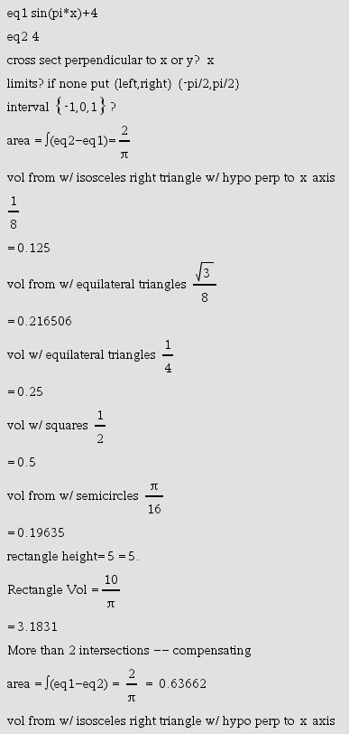

# NspireCrossSectionVolume
Solves for Cross Section Volumes of area between graphs

©2017 Mason Cole (mason-cole.com)
crosssectvol() v1.1
Solves for area and volume by cross section for the area between two graphs (and within the specified bounds). Also solves graphs with multiple points of intersection.

